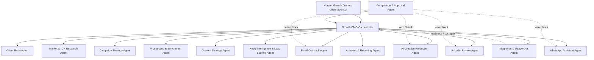

# Agent Architecture

Growth Automation Studio uses 14 logical agents: one supervisory orchestrator and thirteen specialists. These are prompt, permission, output, and audit boundaries; they do not need to be separate services in V1.

## Reporting Structure

## Agent Set

| Agent | Role |
| --- | --- |
| Growth CMO Orchestrator | Supervises priorities, specialist work, campaign decisions, scheduled AI CMO reviews, and human approval routing. |
| Client Brain Agent | Maintains client positioning, ICPs, offers, tone, brand kit, proof rules, approval rules, and CRM handoff logic. |
| Market & ICP Research Agent | Finds audience triggers, buying windows, competitor movement, category angles, and campaign opportunities. |
| Campaign Strategy Agent | Converts research into 2-3 active campaign lanes with audience, offer, CTA, channel mix, and KPI targets. |
| Prospecting & Enrichment Agent | Builds prospect criteria, imports/enriches lists, deduplicates records, and flags fit or consent gaps. |
| Content Strategy Agent | Creates LinkedIn, email, WhatsApp, article, newsletter, landing-page, and sales narrative drafts. |
| AI Creative Production Agent | Generates editable creatives, carousels, decks, one-pagers, landing visuals, and template-led short videos. |
| Email Outreach Agent | Manages provider-agnostic email sequences, send requests, reply-to routing, event tracking, and suppression rules. |
| LinkedIn Review Agent | Reviews approved LinkedIn activity, summarizes posts, recommends human actions, and creates tasks with URLs/screenshots. |
| WhatsApp Assistant Agent | Handles approved WABA conversation guidance, qualification, safe replies, opt-outs, and human handoff. |
| Reply Intelligence & Lead Scoring Agent | Classifies replies/signals, updates lead score, detects urgency, and recommends next-best action. |
| Compliance & Approval Agent | Checks consent, claims, proof usage, client references, opt-outs, channel restrictions, and risky language. |
| Analytics & Reporting Agent | Creates campaign dashboards, weekly growth reports, AI CMO review briefs, channel performance insights, and next-week recommendations. |
| Integration & Usage Ops Agent | Monitors connectors, credits, API usage, email/WhatsApp/AI spend, failures, and readiness gates. |

## Operating Rules

- The orchestrator coordinates; it does not directly publish, send, or approve sensitive work.
- Specialists produce structured outputs: recommendations, drafts, tasks, classifications, scores, reports, or blockers.
- The Growth CMO Orchestrator may facilitate scheduled voice reviews, capture decisions, and propose action plans, but it cannot apply material strategy or execution changes without the required human approval gate.
- Compliance has veto power over sends, publishing, proof usage, risky claims, WhatsApp actions, and LinkedIn recommendations.
- Integration & Usage Ops controls live-readiness and cost visibility before execution.
- Humans approve final public use, LinkedIn actions, strategic overrides, and sales conversations.
