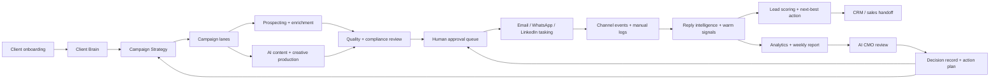

# Event Flow Architecture

## End-To-End Flow

## Core Event Loop

1. Client onboarding creates or updates the Client Brain.
2. Research and campaign strategy agents propose campaign lanes.
3. Prospecting and creative agents prepare the audience, assets, and outreach material.
4. Compliance reviews proof, claims, consent, channel policy, and approval needs.
5. Human approval releases controlled execution tasks.
6. Email, WhatsApp, and LinkedIn tasking create channel events and manual logs.
7. Reply Intelligence classifies replies and warm signals.
8. Qualified conversations are handed to CRM or sales owners.
9. Analytics prepares the scheduled AI CMO review brief.
10. The AI CMO review captures decisions, action items, and approval needs.
11. Approved decisions feed the next campaign decision cycle.

## Event Design

All events should include:

- `eventType`
- `clientId`
- `sourceAgentId` or `sourceSystem`
- `campaignId`, where applicable
- `leadId` or `contactId`, where applicable
- `sourceContext`
- `confidence`
- `riskLevel`
- `recommendedAction`
- `approvalRequired`
- `createdAt`

## Machine-Readable Contract

The implementation contract lives in `data/event-taxonomy.json`.

It defines:

- Common required fields for every event.
- Source identity rules for agent-emitted and system-emitted events.
- Conditional identity fields for campaigns, leads, and contacts.
- Event-specific required and optional fields.
- Primary data objects touched by each event.
- Default risk level and approval requirement per event type.
