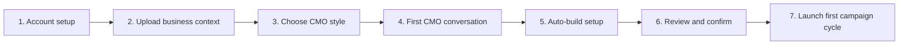

# Zandem.ai Onboarding One-Sheet

## Purpose

Zandem.ai turns one guided founder or growth-owner conversation into a ready-to-review B2B pre-CRM growth setup: Client Brain, campaign lanes, outreach assets, channel rules, warm-signal logic, CRM handoff, and AI CMO review rhythm.

## Who This Is For

- Founder-led B2B companies.
- B2B service businesses.
- B2B product or platform teams with a clear offer.
- Teams that need a structured growth operating layer before or around their CRM.

## What The Client Provides

- Website URL.
- Company deck, sales deck, or proposal deck.
- Case studies, testimonials, client logos, or proof points.
- Current offer, packages, pricing boundaries, and target customer notes.
- Existing sales process or CRM handoff process.
- Approved and blocked claims.
- Channel preferences for email, LinkedIn, WhatsApp, and CRM.
- Access details only where needed and only after the client approves the integration scope.

## Onboarding Flow

## Choose Your CMO Style

The client chooses a facilitation style for the AI CMO:

- **Strategic CMO**: positioning, market clarity, and campaign direction.
- **Direct Operator**: execution focus, priorities, and weekly action.
- **Creative Growth Lead**: campaign angles, content ideas, and brand voice.
- **Conservative Advisor**: careful claims, compliance, and risk control.
- **Founder Coach**: conversational strategy partner for early-stage founders.

The style affects tone and meeting rhythm. It does not change compliance rules, approval gates, or channel guardrails.

## First CMO Conversation Agenda

- What the company sells.
- Who the best-fit buyers are.
- Why buyers choose the company.
- Which proof points can be used.
- Which claims, industries, or accounts are off limits.
- Which offer should be prioritized.
- Which channels are allowed.
- How sales handoff works today.
- What a successful first 30 days should look like.
- How often the AI CMO review should happen.

## Auto-Generated Setup

After the first conversation, the Growth CMO Orchestrator drafts:

- Client Brain.
- ICP and offer map.
- Brand, tone, proof, and claim rules.
- Approval rules and blocked actions.
- 2-3 campaign lane drafts.
- Initial campaign asset plan.
- Email, LinkedIn, and WhatsApp operating rules.
- Warm-signal and lead-scoring logic.
- CRM or sales handoff logic.
- Weekly or fortnightly AI CMO review cadence.
- First 30-day action plan.

## Confirmation Gate

The client receives a setup review:

- Approve what is accurate.
- Edit anything that is incomplete.
- Flag assumptions.
- Add missing proof.
- Confirm channel and handoff rules.

Zandem.ai does not activate live campaigns, send outbound messages, publish public assets, change pricing, submit proposals, or modify CRM handoff rules without the required approval.

## First Campaign Cycle Output

The first active cycle should produce:

- Approved Client Brain.
- Approved campaign lanes.
- Campaign kit drafts.
- Outreach workflow drafts.
- LinkedIn task plan.
- Warm-signal tracker.
- Sales handoff sheet or CRM handoff rules.
- First AI CMO review date.

## Success Criteria

- The client can understand the growth system in one review.
- Campaign lanes are clear enough to approve, revise, pause, or launch.
- Risky claims and unsupported proof are caught before execution.
- Every action item has an owner, due date, and approval status.
- The next AI CMO review has a defined agenda and performance baseline.
