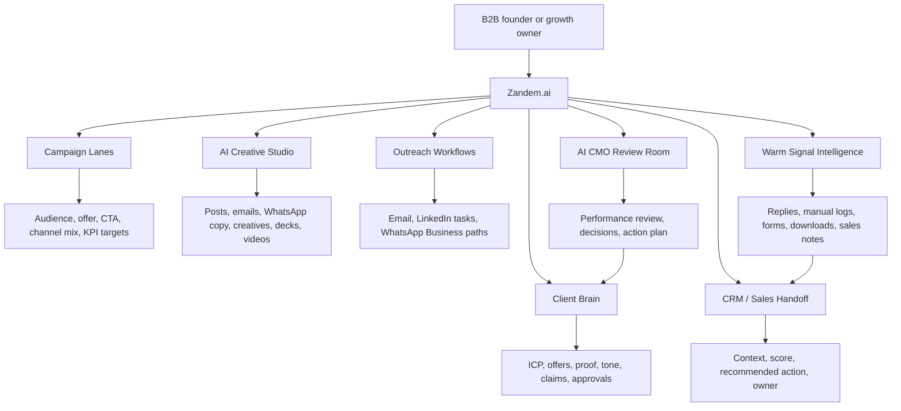
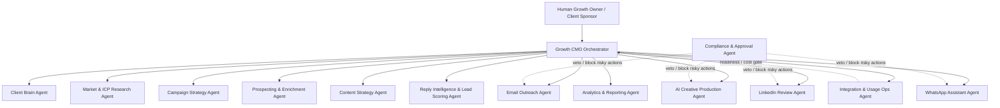
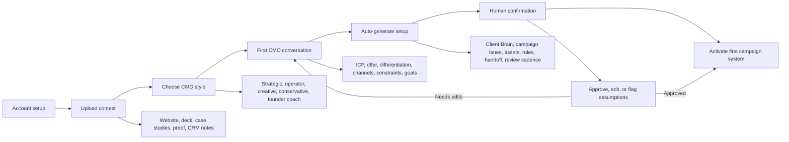
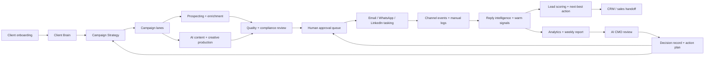
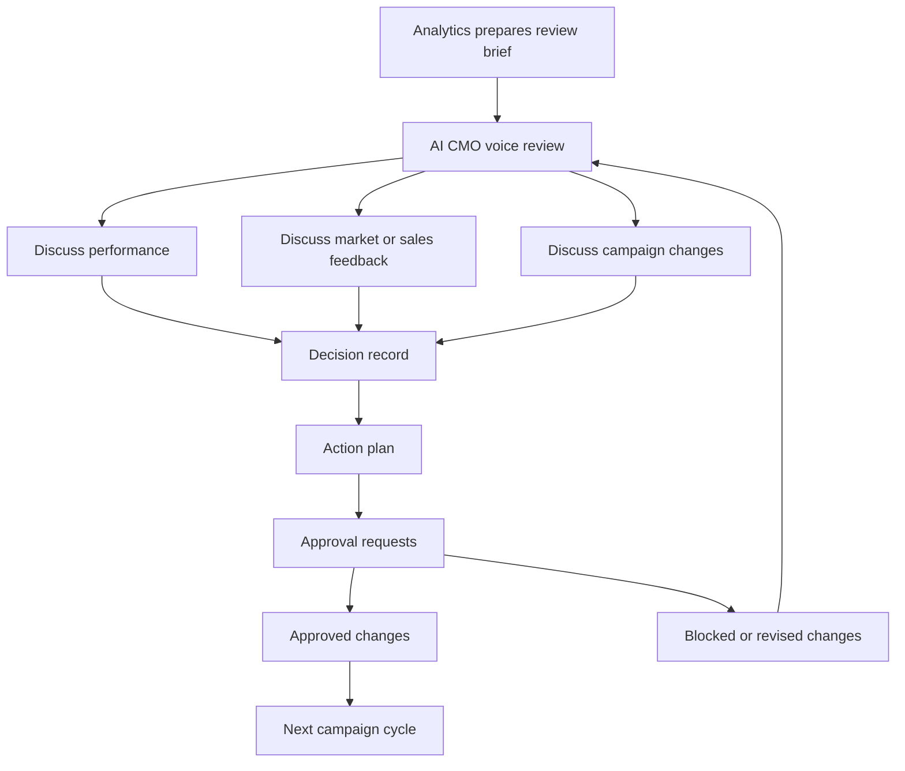
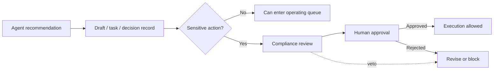

# Zandem.ai Product Flowcharts

Visual explainer for the Zandem.ai product model, onboarding flow, event loop, and approval boundaries.

## Product In One View

## Operating Model

## AI-Led Onboarding Setup

CMO style changes the facilitation tone and working rhythm. It does not override compliance, approval rules, claim boundaries, or channel guardrails.

## End-To-End Event Loop

## Review Room Decision Loop

## Approval Boundary

Sensitive actions include public content, outbound sends, LinkedIn actions, WhatsApp templates, campaign activation, pricing, proposals, client references, CRM handoff rule changes, and major strategy changes.
