# Zlicc Growth Console Architecture

Version: 0.2  
Created: 2026-05-21  
Purpose: Architecture blueprint for the Zlicc-owned prospecting, demand generation, and CMO automation system.

---

## 1. System Goal

The Zlicc Growth Console is not a generic CRM. It is a pre-CRM growth layer that allows the CMO Brain to plan campaigns, classify leads, choose the correct Zlicc offer, create content, manage quality, trigger outreach, and learn from campaign results.

Bigin by Zoho CRM remains the customer lifecycle CRM for now. The Growth Console owns prospecting, demand generation, nurture, warm-signal tracking, and qualified lead handoff; Bigin owns deeper customer engagement, deals, proposals, and account lifecycle until a later integration phase.

Core operating principle:

```text
Discover lead
-> enrich contact
-> classify and score
-> choose Zlicc offer
-> create content and outreach
-> quality check
-> human approval
-> execute via WhatsApp, email, and LinkedIn-assisted actions
-> measure
-> improve the next campaign
```

---

## 2. Full Ecosystem Architecture

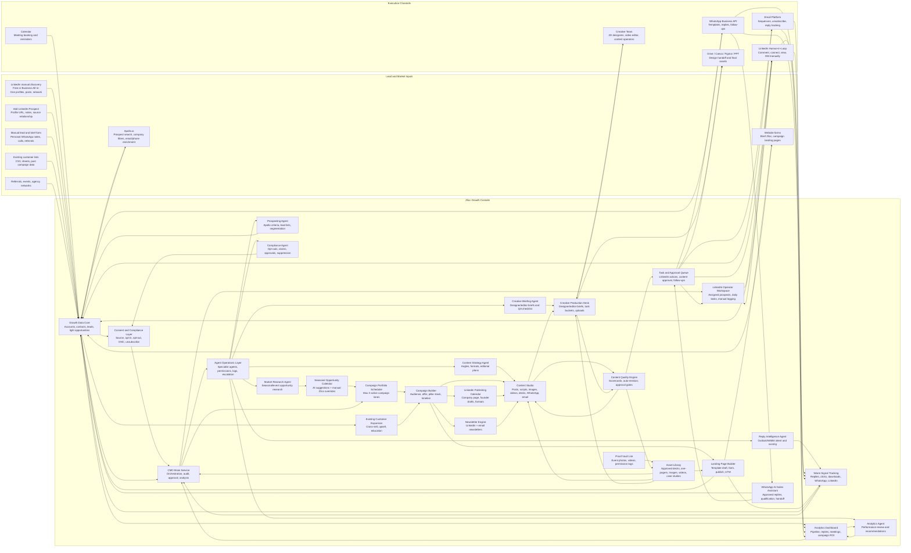

---

## 3. Campaign Orchestration Flow

This is the main automation flow for every campaign.

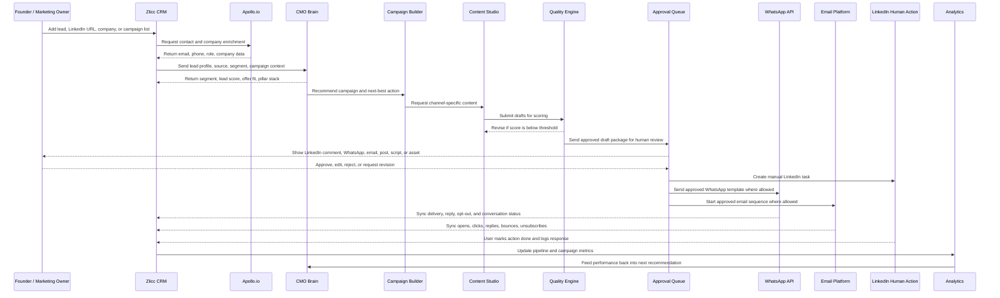

---

## 4. Lead Pipeline State Machine

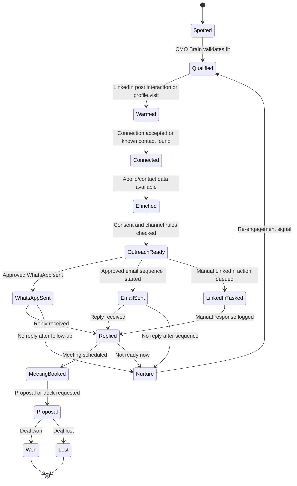

---

## 5. Content Quality Engine

The Content Quality Engine protects Zlicc from generic, weak, off-brand, or unapproved content.

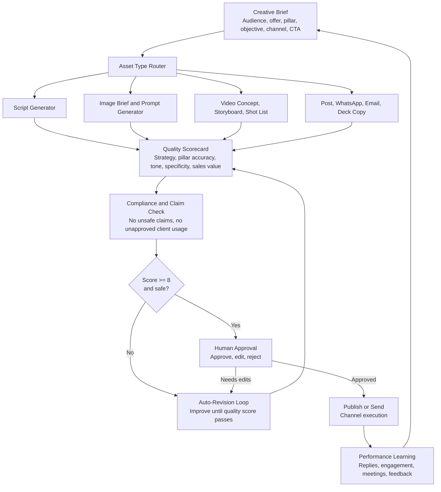

---

## 6. Content Creation Automation

The CRM should create content from campaign strategy, not from random prompts.

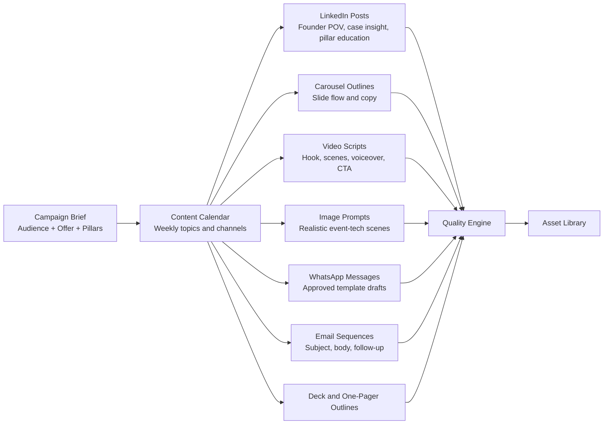

---

## 7. Creative Production Desk

The Creative Production Desk turns campaign strategy into clear tasks for designers, video editors, and content operators. The CMO Brain creates the context; the human team creates the polished final assets.

```mermaid
flowchart LR
  CAMPAIGN["Campaign or lead need"]
  CMO["CMO Brain\nCreative context and asset recommendation"]
  BRIEF["Production Brief\nAudience, offer, copy, format, references, deadline"]
  BUCKET["Task Bucket\nDesigner, video editor, content operator"]
  CREATE["Human Production\nDesign, edit, Runway, Canva, Figma, PPT"]
  UPLOAD["Asset Upload\nSource file, export, notes, version"]
  QA["Quality Review\nBrand, pillar accuracy, visual quality, CTA"]
  APPROVAL["Founder / Marketing Approval"]
  LIBRARY["Approved Asset Library"]
  CAMPAIGNUSE["Campaign Execution\nWhatsApp, email, LinkedIn, deck, landing page"]

  CAMPAIGN --> CMO
  CMO --> BRIEF
  BRIEF --> BUCKET
  BUCKET --> CREATE
  CREATE --> UPLOAD
  UPLOAD --> QA
  QA -->|Needs edits| BUCKET
  QA -->|Passes| APPROVAL
  APPROVAL -->|Approved| LIBRARY
  APPROVAL -->|Changes| BUCKET
  LIBRARY --> CAMPAIGNUSE
```

Required production task fields:

- Campaign, lead, offer, and Zlicc pillar.
- Asset type: static, carousel, reel, video, deck, WhatsApp creative, email visual, landing page visual.
- Assigned owner: designer, video editor, copywriter, strategist, or operator.
- Creative brief, copy/script, references, format, size, duration, deadline, priority.
- Status: briefed, in progress, uploaded, needs revision, approved, live, archived.
- Uploads: source file, exported file, thumbnails, notes, version history.
- Quality score and reviewer comments.

---

## 8. Manual Lead And Brief Capture Form

Personal WhatsApp should not be automated or scraped. If a customer shares a brief, campaign requirement, solution document, or deck over personal WhatsApp, the CRM should provide a simple manual form to capture it in a few lines.

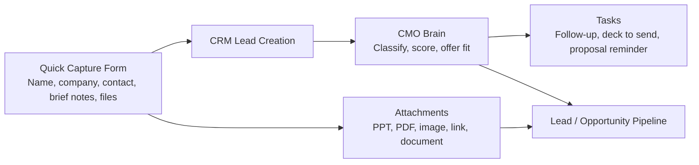

Minimum form fields:

- Contact name.
- Company name.
- Mobile/WhatsApp number.
- Email, optional.
- LinkedIn URL, optional.
- Source: personal WhatsApp, LinkedIn, referral, event, inbound, existing customer.
- Brief notes: free text.
- Required solution or event type, optional.
- Upload files: PPT, PDF, image, video reference, DOCX, link.
- Next follow-up date, optional.

Form behavior:

- If contact/company exists, attach the note and files to the existing record.
- If not, create account, contact, lead, and opportunity draft.
- CMO Brain classifies audience, recommends offer/pillars, and creates next-best action.
- No personal WhatsApp messages enter the CRM unless manually pasted, summarized, uploaded, or forwarded by the user.

---

## 9. Prospecting Sources And LinkedIn Capture

The Growth Console should support two prospecting paths that feed the same lead pipeline.

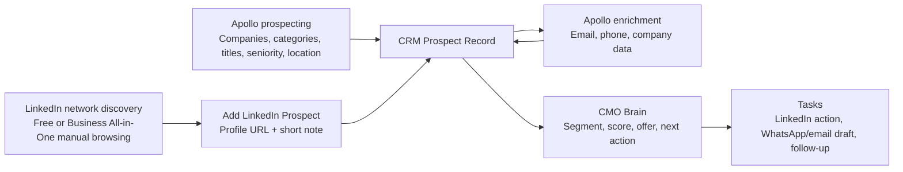

`Add LinkedIn Prospect` fields:

- LinkedIn profile URL.
- Name, company, and role, optional.
- Relationship source: own network, team network, 2nd-level, 3rd-level, post interaction, referral, event.
- Notes: why this person looks relevant.
- Optional campaign or offer tag.
- Priority: low, medium, high.

Behavior:

- Do not scrape LinkedIn automatically.
- Create or update the prospect from the manually provided URL and notes.
- Use Apollo to enrich the person/company when enough details are available.
- CMO Brain classifies the lead, recommends Zlicc offer/pillars, and creates next actions.
- LinkedIn Business All-in-One is treated as an optional relationship and visibility layer, not as the core data source.

---

## 10. LinkedIn Operator Workspace

The LinkedIn Operator Workspace is a separate role-based interface for a person assigned to execute LinkedIn relationship-building tasks. The operator does not control campaign strategy; they execute the CMO Brain's LinkedIn action queue manually.

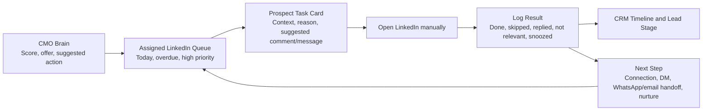

Operator workspace screens:

- Today: assigned tasks, priority, overdue follow-ups, hot replies.
- Prospect detail: profile URL, company, role, segment, score, recommended offer, relevant pillars.
- Suggested copy: comment, connection note, first DM, follow-up DM.
- Action logging: done, skipped, no relevant post, connection sent, connected, DM sent, replied, not relevant.
- Notes: short operator note and response summary.

LinkedIn Operator permissions:

| Capability | Permission |
| --- | --- |
| View assigned LinkedIn prospects | Allowed |
| Open LinkedIn profile links | Allowed |
| View suggested comments/DMs | Allowed |
| Mark tasks done, skipped, snoozed, or replied | Allowed |
| Add notes and response summaries | Allowed |
| Edit lead score or CMO recommendation | Not allowed |
| Send WhatsApp campaigns or email sequences | Not allowed |
| Delete leads or change CRM settings | Not allowed |
| Edit CMO Brain, prompts, API keys, or campaign strategy | Not allowed |

---

## 11. WhatsApp AI Sales Assistant

The WhatsApp AI Sales Assistant handles first-level campaign replies from WABA. It is connected to the CMO Brain, but it must operate inside approved sales guardrails and hand off quickly when the conversation becomes high intent or complex.

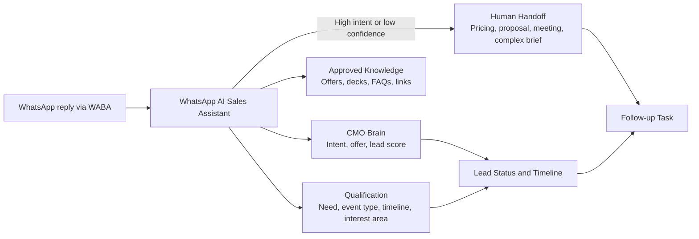

Bot can answer or route:

- Send details, deck links, landing page links, and approved capability summaries.
- Explain Zlicc, a specific pillar, or a campaign offer in short approved language.
- Ask qualifying questions: company, event type, timeline, expected audience, interest area, call preference.
- Handle not interested, wrong person, remove me, or unsubscribe intent.

Human handoff triggers:

- Pricing, proposal, meeting request, complex brief, negative sentiment, low-confidence answer, repeated back-and-forth, or high lead score.

---

## 12. Landing Page Builder

Landing pages should be generated and published from inside the Growth Console. The user should not need to manually upload HTML files for normal campaigns.

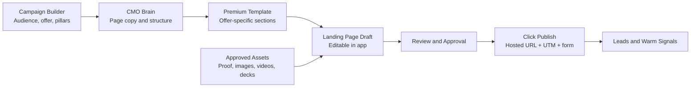

V1 publishing default:

- Growth Console hosted pages under a Zlicc-controlled domain or subdomain.
- Fixed premium templates for Agency Tech Partner, ZliccPulse Activity Menu, AI Event Experience Kit, Exhibition Booth Intelligence, Hybrid AGM/Webcast, Product Launch Experience, and Existing Customer Expansion.
- Editable sections: headline, subheadline, problem, offer, pillar stack, use cases, proof/assets, downloadable deck, WhatsApp CTA, lead form, UTM tags.

Later optional integrations:

- Webflow publish/sync, main Zlicc website publish, or HTML export.

---

## 13. Seasonal Opportunity Calendar

The Seasonal Opportunity Calendar should combine AI-assisted market timing with manual Zlicc experience. Human-entered Zlicc knowledge overrides generic calendar assumptions.

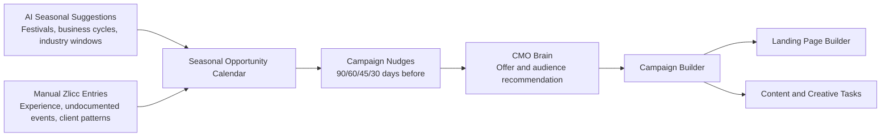

Opportunity fields:

- Name, category, planning window, event window, audience, industries, recommended offer, relevant pillars, priority, source, notes, repeat yearly, reminders, linked campaign, linked landing page.

Examples:

- AGM planning season: planning window April-August; campaign should begin earlier; offer: ZliccLive + ZliccSync + ZliccAI + ZliccStudio.
- Festive activation planning: start 60-90 days before major festive windows; offer: ZliccPulse + ZliccStudio + ZliccXR.
- Undocumented event cycles: manually added based on agency/client experience even when not listed on public calendars.

---

## 14. Expansion, Agency, Warm Signal, And Proof Threads

These threads remain v1 because they directly improve prospecting quality and campaign timing.

Existing Customer Expansion:

- Import known contacts and companies.
- Tag by past project, industry, relationship strength, likely next offer, and permission status.
- Run education, cross-sell, and upsell campaigns without treating warm customers like cold prospects.

Agency Partner Thread:

- Separate prospecting path for event, experiential, exhibition, creative, production, and MICE agencies.
- Track agency type, sectors served, partnership potential, likely Zlicc stack, and repeat opportunity potential.

Warm Signal Tracking:

- Track SendGrid opens/clicks, Outlook replies, WABA replies, landing page form fills, deck downloads, LinkedIn accepted connections/logged interactions, and WhatsApp bot qualification.
- Use these signals to adjust lead score, stage, and follow-up urgency.

Proof Vault Lite:

- Upload event photos, videos, decks, recap links, campaign screenshots, and metrics.
- Tag by client, pillar, use case, industry, public-safe/internal-only, and permission status.
- Let CMO Brain recommend proof assets for campaigns and landing pages.

---

## 15. Campaign Portfolio And LinkedIn Publishing Rhythm

The Growth Console should run a campaign portfolio, not a single weekly campaign. The operating rhythm is weekly, but multiple campaign lanes can run in parallel.

Portfolio rule:

- Maximum three active campaign lanes at one time.
- Tier 1: up to two aggressive prospecting campaigns.
- Tier 2: up to one nurture, education, existing customer, or agency relationship campaign.
- Additional campaigns remain draft, scheduled, paused, or archived until capacity opens.

Campaign lane fields:

- Campaign name, seasonal trigger, target audience, target roles, prospect list, offer, pillar stack, landing page, content set, LinkedIn publishing plan, outreach sequence, creative tasks, owner, priority, status, and metrics.

Example active lanes:

- AGM / Investor Communication: company secretaries, investor relations, listed companies, BFSI, NSDL/CDSL ecosystem.
- Global Fintech Fest / Exhibition Stack: fintech brands, BFSI marketers, booth agencies, exhibition agencies.
- Agency Tech Partner Push: event, experiential, exhibition, MICE, and production agencies.

LinkedIn Publishing Calendar:

- Plan company page posts and founder/profile drafts separately.
- Supported formats: text POV posts, document/carousel posts, polls, short videos, proof/image posts, articles, newsletters, case-study posts, and landing-page posts.
- Do not publish all campaign content on one day; distribute posts across the week.

Recommended v1 cadence:

- Company page: three posts per week.
- Founder/profile drafts: two to three posts per week.
- Carousel/document: one per week.
- Short video: one per week when production capacity allows.
- Poll: one to two per month.
- Article: one per month.
- Newsletter: one per month.

Recommended weekly rhythm:

- Tuesday: primary campaign post or carousel, plus approved outreach batch.
- Wednesday: second campaign post, short video/proof post, or second approved outreach batch.
- Thursday: follow-ups, LinkedIn engagement, warm-signal review, WhatsApp handoffs.
- Saturday: optional lighter post, poll, recap, behind-the-scenes, or visual showcase.

Newsletter Engine:

- LinkedIn newsletter for authority-building and audience education.
- Email newsletter for existing customers, warm leads, agencies, and opted-in contacts.
- Monthly cadence by default; do not start with a weekly newsletter.
- Repurpose best campaign insights, proof assets, and high-performing posts into newsletter editions.

---

## 16. Agent Operations Layer

The CMO Brain is the orchestrator, reviewer, auditor, approver, and analyst. It should not perform every specialist task directly. Specialist agents produce research, drafts, lists, briefs, classifications, and reports; the CMO Brain reviews and decides what becomes active.

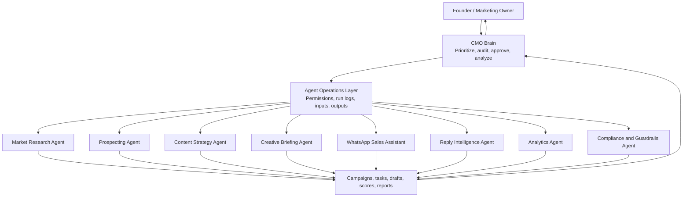

V1 specialist agents:

- Market Research Agent: finds timely campaign opportunities, events, seasonal windows, and "why now" triggers.
- Prospecting Agent: creates Apollo criteria, segments lists, scores raw prospects, and prepares enrichment-ready targets.
- Content Strategy Agent: creates campaign angles, LinkedIn formats, newsletter ideas, article topics, and editorial plans.
- Creative Briefing Agent: turns campaign strategy into designer/video editor briefs with specs, references, scripts, and quality checklists.
- WhatsApp Sales Assistant: handles approved first-level WABA replies, qualification, and human handoff.
- Reply Intelligence Agent: classifies Outlook and WABA replies, updates lead scores, and creates follow-up tasks.
- Analytics Agent: reviews campaign performance, warm signals, landing page performance, and recommends adjustments.
- Compliance and Guardrails Agent: checks opt-outs, unsafe claims, client references, pricing promises, suppression rules, and approval requirements.

Each agent record should store:

- Purpose, allowed inputs, allowed tools, output type, approval requirement, escalation rules, last run, run logs, quality score, and error state.

Agent hierarchy rule:

- Specialist agents suggest, draft, classify, score, and summarize.
- CMO Brain prioritizes, audits, approves, pauses, redirects, and analyses.
- Human approval remains required for public publishing, sensitive claims, pricing, proposals, client references, and campaign activation.

---

## 17. Version 2 Backlog

Keep these in scope for future planning, but do not build them before the prospecting engine is stable.

- Referral Engine: referral sources, introduction requests, referral status, thank-you follow-ups.
- Competitor and Market Intelligence: competitor/agency campaign tracking, market trend notes, positioning gaps.
- Full Proof and Case Study Engine: case study drafts, testimonial tracking, public/private story variants, result narratives.
- Partner and Vendor Ecosystem: AV, production, booth, creative, tech, and event partner database.
- Delivery Capacity Check: production/team/vendor availability before aggressive campaign pushes.
- Win/Loss Intelligence: reason won/lost, objections, competitor involved, budget/timing notes.
- Bigin Integration: push qualified prospects, contacts, notes, and opportunities into Bigin for lifecycle CRM management.
- Webflow/Main Website Publishing: optional landing page publishing integration once the native page builder is proven.

---

## 18. Core Data Model

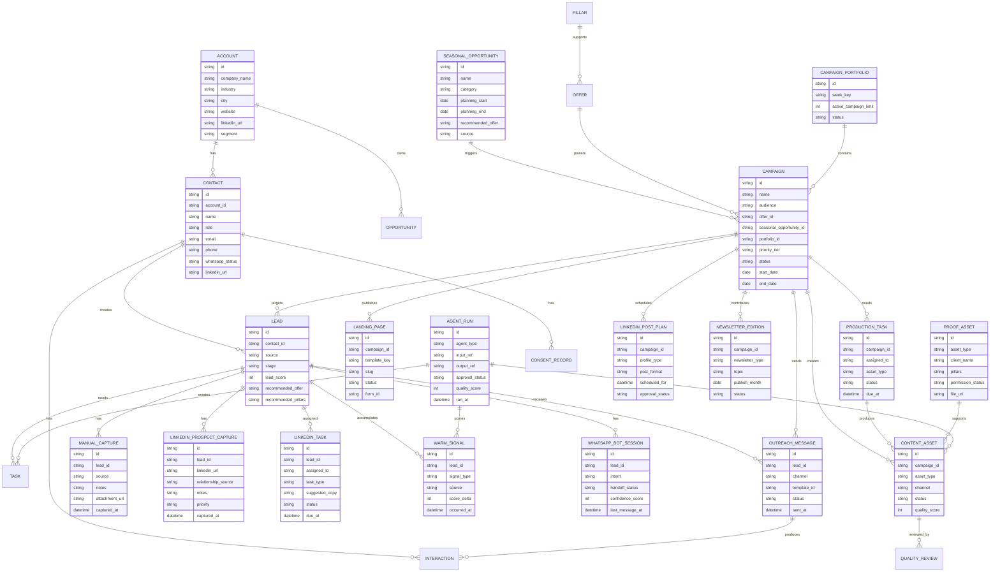

---

## 19. Integration Map

| Integration | Direction | Purpose |
| --- | --- | --- |
| Apollo.io | CRM to Apollo, Apollo to CRM | Prospect search, company/person filters, contact enrichment, verified email/phone discovery |
| WhatsApp Business API provider | CRM to provider, provider to CRM | Approved templates, campaign replies, bot sessions, human handoff, opt-outs, conversation sync |
| SendGrid or email platform | CRM to provider, provider to CRM | Email sequences, unsubscribe, bounce, click tracking, campaign metadata |
| Microsoft 365 Outlook via Graph | Outlook to CRM | Inbound reply intelligence from the user's mailbox when SendGrid reply-to responses arrive |
| OpenAI API | CRM to AI service | CMO Brain, lead scoring, content generation, quality review, summaries |
| Google Drive or asset storage | Two-way | Store and retrieve decks, images, videos, one-pagers, approved assets |
| Creative tools | Team to CRM, CRM to storage | Designer/editor uploads from Canva, Figma, PPT, Runway exports, and video editing workflows |
| Calendar | Two-way | Meeting booking, follow-up reminders, campaign review reminders |
| Website forms | Website to CRM | Inbound brief capture, landing page conversion, UTM source capture |
| Native landing page publisher | CRM to web, web to CRM | Publish Growth Console hosted campaign pages, forms, download gates, and warm signals |
| Manual quick capture form | User to CRM | Personal WhatsApp notes, call notes, files, and brief details entered manually |
| LinkedIn prospect capture form | User/team to CRM | Manual LinkedIn profile URL entry from own network, team network, 2nd-level or 3rd-level prospects |
| Seasonal calendar sources | External/manual to CRM | Public calendars, industry event windows, manual Zlicc experience entries, campaign reminders |
| Analytics | Channel tools to CRM | Campaign attribution, warm signals, replies, meetings, offer performance |
| LinkedIn / Business All-in-One | Manual assisted | Human-in-loop discovery, visibility, InMail/profile review, comments, connection notes, DMs, profile research |
| Agent Operations Layer | Internal | Specialist agent runs, logs, outputs, quality scores, approval routing, escalation state |

---

## 20. Automation Boundaries

Fully automate:

- Lead classification.
- Lead scoring.
- Audience segmentation.
- Offer and pillar recommendation.
- Specialist agent runs for research, prospecting, content planning, creative briefs, reply intelligence, analytics, and compliance checks.
- Apollo-led prospect list import.
- Apollo enrichment.
- Seasonal opportunity recommendations from approved calendar entries.
- Campaign portfolio recommendations with maximum three active campaign lanes.
- Landing page draft generation from fixed templates.
- LinkedIn publishing calendar draft generation.
- Newsletter draft generation and monthly editorial planning.
- Content drafting.
- Production brief generation.
- Designer/editor task creation.
- LinkedIn operator task generation and assignment.
- Quality scoring and revision.
- Email sequence generation and sending where compliant.
- WhatsApp template sending where compliant.
- WhatsApp bot first-level qualification and approved answers.
- Outlook reply classification for SendGrid reply-to responses.
- Warm signal scoring.
- Follow-up reminders.
- Weekly campaign reports.
- Dashboard updates.

Human-in-loop:

- CMO Brain approval for specialist agent outputs before campaign activation.
- LinkedIn profile visits, comments, connection requests, and DMs.
- LinkedIn Operator manual execution and response logging.
- Manual LinkedIn prospect URL entry from the founder/team network.
- Manual seasonal opportunity entry and override from Zlicc experience.
- Campaign portfolio activation, pause, and priority decisions.
- Personal WhatsApp brief capture through a quick form or manual upload.
- Designer/editor production of final visual and video assets.
- Landing page approval before publishing.
- LinkedIn company page and founder/profile post approval before publishing.
- Newsletter approval before publishing.
- Public LinkedIn publishing from personal profile.
- Final approval for videos, decks, claims, pricing, and client references.
- Sensitive or high-value prospect outreach.

Never automate blindly:

- Specialist agents activating campaigns without CMO Brain review.
- LinkedIn scraping or auto-messaging.
- Automated LinkedIn profile data extraction from pasted URLs unless using an approved API.
- Personal WhatsApp inbox reading, scraping, or auto-sending.
- Bulk WhatsApp without proper opt-in or opt-out handling.
- Email without unsubscribe and domain authentication.
- Public claims about client work without approval.
- Pricing, proposal promises, or delivery guarantees.
- WhatsApp bot answering outside approved knowledge or continuing when handoff is required.

---

## 21. MVP Build Scope

### Phase 1: Growth Database Core

- Accounts.
- Contacts.
- Leads.
- Lightweight prospecting pipeline stages.
- Tasks.
- Notes.
- Lead source tracking.
- Consent/opt-out fields.
- Quick capture form for personal WhatsApp notes, call notes, brief details, and file uploads.
- Add LinkedIn Prospect form for profile URLs, relationship source, notes, and priority.

### Phase 2: CMO Brain Layer

- Load `Zlicc_CMO_Brain.md`.
- CMO Brain acts as orchestration, audit, approval, prioritization, and analysis layer.
- Agent Operations Layer with specialist agent registry, permissions, logs, outputs, quality scores, and escalation rules.
- Lead classification.
- Lead score.
- Recommended offer.
- Recommended pillar stack.
- Next-best action.
- Draft LinkedIn comment, WhatsApp, and email.
- Reply intent classification for Outlook and WhatsApp responses.
- Seasonal campaign recommendation from the editable calendar.
- Campaign portfolio recommendations with up to three active lanes.
- Specialist agents for market research, prospecting, content strategy, creative briefing, reply intelligence, analytics, and compliance.

### Phase 3: Apollo and Enrichment

- Apollo prospect search/import for selected companies, categories, titles, seniority, location, and other available filters.
- Add enrichment button for CRM leads and manually captured LinkedIn prospects.
- Store email, phone, role, company data.
- Track enrichment source and confidence.

### Phase 4: LinkedIn Workbench

- Treat LinkedIn Business All-in-One as optional relationship/visibility support, not the primary data engine.
- Add LinkedIn Prospect from URL, notes, and source relationship.
- Create LinkedIn Operator role with restricted access.
- Assign LinkedIn tasks to one operator login.
- Operator workspace with today, overdue, high-priority, and replied queues.
- Daily LinkedIn task queue.
- Suggested comment.
- Suggested connection note.
- Suggested DM.
- Manual completion logging.

### Phase 5: WhatsApp and Email

- WhatsApp template library.
- WhatsApp AI Sales Assistant with approved answer library, lead qualification, and human handoff.
- Email sequence library.
- SendGrid campaign event sync.
- Microsoft 365 Outlook reply intelligence for reply-to responses.
- Message approval.
- Sending logs.
- Reply sync.
- Opt-out handling.

### Phase 6: Seasonal Calendar, Campaign Portfolio, and Landing Pages

- Editable Seasonal Opportunity Calendar with AI suggestions and manual Zlicc overrides.
- Opportunity reminders 90/60/45/30 days before campaign windows.
- Campaign Portfolio Scheduler with maximum three active lanes and active, draft, scheduled, paused, completed statuses.
- Native landing page builder with fixed premium templates.
- Click-to-publish Growth Console hosted pages with forms, UTM tracking, downloads, and WhatsApp CTA.

### Phase 7: Content Studio, LinkedIn Publishing, and Newsletter

- Campaign brief generator.
- Weekly content calendar.
- LinkedIn Publishing Calendar for company page posts and founder/profile drafts.
- Supported LinkedIn formats: text POV, document/carousel, poll, short video, proof/image post, article, newsletter, case-study post, landing-page post.
- Newsletter Engine for monthly LinkedIn and email newsletters.
- LinkedIn post drafts.
- Carousel outlines.
- Video scripts.
- Image prompts.
- Deck/one-pager outlines.
- Quality scorecard.
- Approval status.

### Phase 8: Creative Production Desk

- Production task buckets for designers, video editor, copywriter, strategist, and content operator.
- Auto-generated creative briefs from campaign context.
- Upload area for source files and final exports.
- Version history, review comments, and approval status.
- Asset handoff into approved library after quality review.

### Phase 9: Expansion, Agency, Warm Signals, and Proof

- Existing customer import, tags, and cross-sell/upsell education segments.
- Agency partner prospecting segment and agency-specific scoring.
- Warm signal tracking from email, Outlook, WABA, landing pages, downloads, and LinkedIn logs.
- Proof Vault Lite for project images, videos, permission status, and campaign reuse.

### Phase 10: Analytics

- Campaign dashboard.
- Lead source dashboard.
- Offer performance.
- Channel performance.
- Creative production status.
- Asset quality and revision count.
- Landing page performance.
- Warm signal performance.
- Weekly CMO report.

---

## 22. Recommended First Screen Layout

```mermaid
flowchart TB
  HOME["Growth Console Home"]
  TODAY["Today\nTasks, approvals, hot replies"]
  AGENTS["Agent Ops\nRuns, logs, approvals, escalations"]
  CAPTURE["Quick Capture\nManual lead and brief entry"]
  PROSPECTING["Prospecting\nApollo lists + LinkedIn URL capture"]
  LINKEDINOPS["LinkedIn Operator\nAssigned queue and manual logging"]
  LEADS["Leads\nPipeline, score, stage, owner"]
  SEASONAL["Seasonal Calendar\nOpportunity windows and manual overrides"]
  CAMPAIGNS["Campaign Portfolio\nMax 3 active lanes"]
  LANDING["Landing Pages\nTemplate drafts, forms, publishing"]
  LINKEDINPUB["LinkedIn Publishing\nCompany, founder, formats"]
  NEWSLETTER["Newsletters\nLinkedIn + email editions"]
  CONTENT["Content Studio\nDrafts, scripts, images, videos, decks"]
  PRODUCTION["Creative Production Desk\nDesigner/editor tasks and uploads"]
  OUTREACH["Outreach\nWhatsApp bot, email, LinkedIn tasks"]
  ASSETS["Assets\nDecks, one-pagers, proof vault"]
  CUSTOMERS["Existing Customers\nExpansion and education segments"]
  ANALYTICS["Analytics\nReplies, meetings, wins, campaign learning"]

  HOME --> TODAY
  HOME --> AGENTS
  HOME --> CAPTURE
  HOME --> PROSPECTING
  HOME --> LINKEDINOPS
  HOME --> LEADS
  HOME --> SEASONAL
  HOME --> CAMPAIGNS
  HOME --> LANDING
  HOME --> LINKEDINPUB
  HOME --> NEWSLETTER
  HOME --> CONTENT
  HOME --> PRODUCTION
  HOME --> OUTREACH
  HOME --> ASSETS
  HOME --> CUSTOMERS
  HOME --> ANALYTICS
```

---

## 23. Final Operating Loop

The final system should run this loop every week:

```text
Monday: Specialist agents surface research, prospecting, and performance inputs. CMO Brain reviews campaign portfolio, seasonal windows, and capacity. Confirm up to three active campaign lanes.
Tuesday: Publish/send first priority campaign batch; Content Studio and Landing Page Builder prepare upcoming assets.
Wednesday: Publish/send second campaign batch; Creative Production Desk and Quality Engine clear asset approvals.
Thursday: Run follow-ups, LinkedIn engagement, warm-signal review, and WhatsApp bot human handoffs.
Friday: Analytics Agent reports performance by campaign lane. CMO Brain audits results and adjusts next week's portfolio.
Saturday: Optional lighter LinkedIn post, poll, recap, behind-the-scenes, or visual showcase.
```

The system is successful when it can answer:

- Which audience should Zlicc pursue this week?
- Which campaign lanes are active, paused, scheduled, or completed?
- Which specialist agent outputs need CMO Brain review?
- Which seasonal opportunity window is driving the campaign?
- Which Zlicc offer should be pitched?
- Which landing page should receive the traffic?
- Which LinkedIn formats are scheduled this week?
- Which newsletter edition is due this month?
- Which content should be created?
- Which designer/editor assets are pending?
- Which LinkedIn Operator tasks are pending or overdue?
- Which WhatsApp bot conversations need human handoff?
- Which warm signals changed lead score this week?
- Which leads need human action today?
- Which WhatsApp/email messages can safely go out?
- Which assets need approval?
- Which campaign is producing replies, meetings, and proposals?
